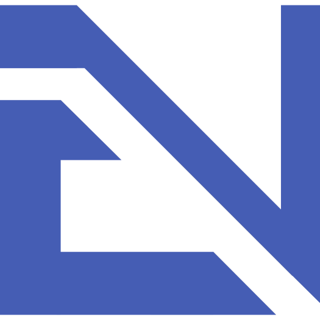

    
    <h1>Portfolio Website 🌐</h1>
    
    
    
    
    

## Table of Contents

1. [Overview](#-overview)
2. [License](#-license)

## 🌟 Overview

Welcome to my portfolio! My Website aims to showcase my academic background, technical skills, industry experience, and the diverse projects I've undertaken. My portfolio was built using ReactJS, JavaScript, CSS + Tailwind CSS, HTML, and Netlify.

This repository serves as a proof of concept, demonstrating the core functionalities and overall architecture. Please note that the complete source code is hosted in a separate repository, and some important code is intentionally omitted here.

The current site is [LIVE](https://eduardonunez.dev)

---

## 📄 License

This project is licensed under the MIT License - see [LICENSE.md](LICENSE.md) for details.
