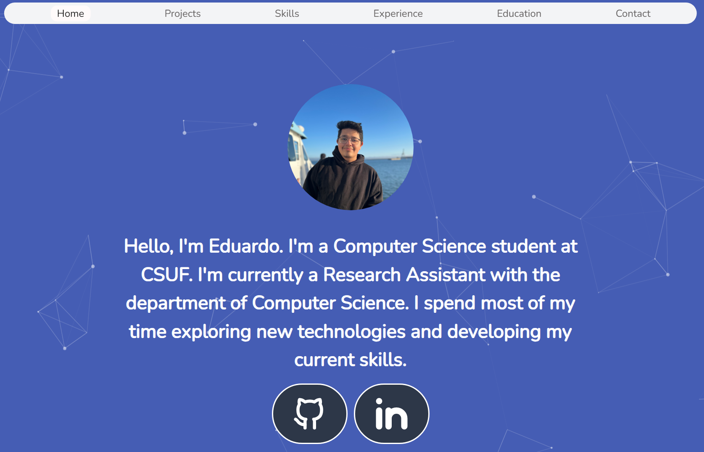
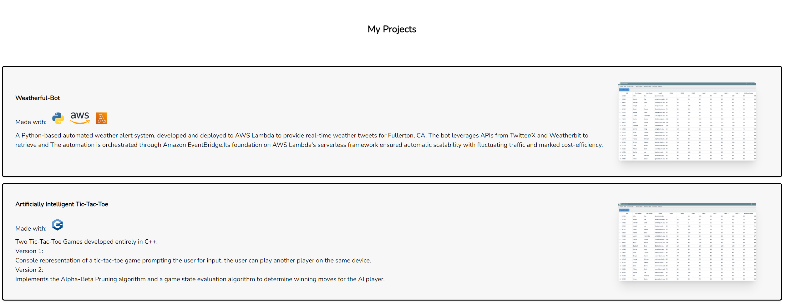
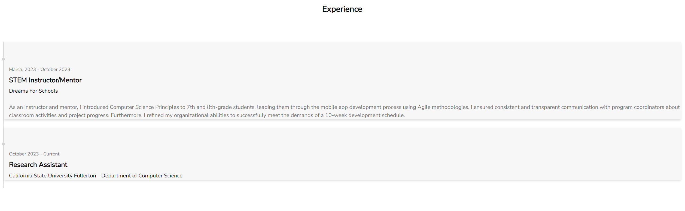

    
    <h1>Personal Website (Work In Progress) 🌐</h1>
    
    
    
    
    

## Table of Contents
1. [Overview](#-overview)
2. [Features and Demo](#features-and-demo)
3. [Setting up the Development Environment](#%EF%B8%8F-setting-up-the-development-environment)
4. [License](#-license)

## 🌟 Overview

Welcome to my portfolio! My Website aims to showcase my academic background, technical skills, industry experience, and the diverse projects I've undertaken. ***This Website is still under construction*** it's being built with NodeJS, TailwindCSS, NPM, and Particles.js.

---

## **Features and Demo**

#### Feature 1: Landing Page
- **Description**: Upon the user landing the GitHub and linkedin icons are animated in as well as the Particles.js dynamic background. Users can interact with these components as they wish. 

  - **Screenshot**: 

    

#### Feature 2: Project Section
- **Description**: When the user scrolls down past the home section my projects are displayed. Each project is described along with a demo picture, the tools I used (frameworks, utilities, languages, etc.) 

  - **Screenshot**: 
  
    

#### Feature 3: Skills Section
- **Description**: Below the project section I display my skills which consists of technologies, languages, frameworks, etc. 

  - **Screenshot**: 
  
    

#### Feature 4: Experience Section
- **Description**: This section will contain all of my industry experience in reverse chronological order (most recent at the top). It contains starting and ending dates, responsibilities, company, and position title.

  - **Screenshot**: 

    

#### Feature 5: Education Section (Coming Soon)
- **Description**: Showcase my educational background such as my University, Major, and academic achievements.

  - **Screenshot**: 

      **Coming Soon** 

#### Feature 6: Contact Form (Coming Soon) 
- **Description**: This section will allow users to fill in any messages they would like to send me, a simple form in which a user can input their email and message. 

  - **Screenshot**: 

      **Coming Soon** 
---

## 🛠️ Setting Up The Development Environment

Feel free to clone the repository to take a look at the codebase! 

1. **Clone the Repository**: 
   - Use the command `git clone https://github.com/eddayyy/personal-website` to clone the repository.

## 📄 License
This project is licensed under the MIT License - see [LICENSE.md](LICENSE.md) for details.