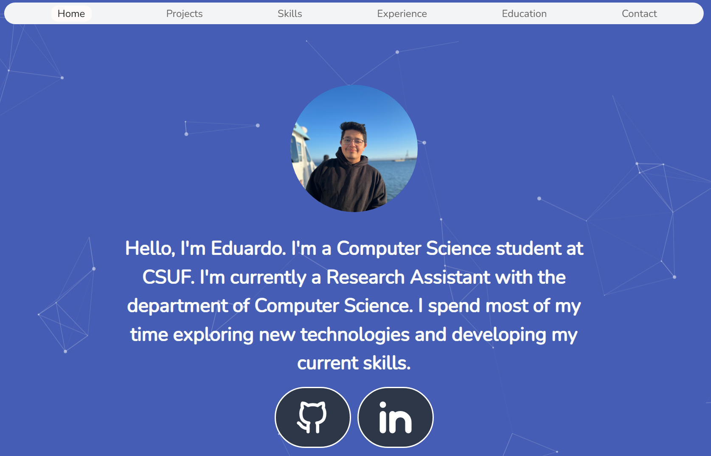

    
    <h1>Personal Website 🌐</h1>
    
    
    
    
    

## Table of Contents
1. [Overview](#-overview)
2. [Features and Demo](#features-and-demo)
3. [Setting up the Development Environment](#%EF%B8%8F-setting-up-the-development-environment)
4. [License](#-license)

## 🌟 Overview

Welcome to my portfolio! My website aims to showcases my academic background, technical skills, industry experience, and the diverse projects I've undertaken. This website is still under construction it's being built with NodeJS, TailwindCSS, NPM, and Particles.js.

## **Features and Demo**
- 

## 🛠️ Setting up the Development Environment

Feel free to clone the repository to take a look at the codebase! 

1. **Clone the Repository**: 
   - Use the command `git clone https://github.com/eddayyy/personal-website` to clone the repository.

## 📄 License
This project is licensed under the MIT License - see [LICENSE.md](LICENSE.md) for details.